# Comprehensive CI/CD Architecture: Jenkins, Docker & Kubernetes

## 📌 Overview

- This repository provides a complete, hands-on implementation of a Continuous Integration and Continuous Deployment (CI/CD) pipeline. 
- It demonstrates how to orchestrate containerized applications using Docker and Kubernetes, automated through customized Jenkins pipelines. 
- The project is designed to be easily deployable on any local or cloud platform by containerizing the CI/CD tools themselves.

## 🚀 Project Highlights
- **Automated CI/CD Workflows:** Utilizes Jenkins Shared Libraries (Groovy) to create modular, reusable `pipelineBackend` and `pipelineDeployment` scripts for scalable lifecycle management. 
- **Isolated Build Environments:** Features a robust Docker-in-Docker (DinD) configuration for Jenkins, allowing secure, isolated image building and pushing directly from the pipeline.
- **Kubernetes Orchestration:** Includes detailed manifests for Deployments, Pods, ReplicaSets, and Services across distinct `stg` (staging) and `prd` (production) environments.
- **Advanced Helm Configurations:** Employs Helm charts to package and dynamically deploy applications like Nginx and customized Node applications.
- **Microservices Demonstration:** Showcases a multi-tier architecture using a sample Voting App, seamlessly integrating Postgres databases, Redis caches, worker nodes, and frontend results.
- **Secure Private Registry:** Implements a self-hosted Docker registry secured with an Nginx reverse proxy, TLS certificates, and basic htpasswd authentication.

## 🔑 Keywords
`CI/CD`, `Jenkins`, `Docker`, `Docker-in-Docker (DinD)`, `Kubernetes`, `Helm`, `Groovy`, `Pipeline-as-Code`, `Microservices`, `DevSecOps`, `Nginx`, `Reverse Proxy`.

## 🛠️ Getting Started

### 1. Network Setup

- First, create a dedicated Docker network to allow your containers to communicate securely[cite: 163]:
```bash
docker network create jenkins
```
### 2. Infrastructure Provisioning
Build the custom Jenkins image and spin up the Jenkins and Docker-in-Docker (DinD) containers:
```bash
# Build the Jenkins image
docker build -t jenkins_jenkins -f Dockerfile .

# Run the Docker-in-Docker container
docker run --name jenkins-docker --rm --detach \
    --privileged --network jenkins --net-alias docker \
    --env DOCKER_TLS_CERTDIR=/certs \
    --volume ~/build/cicd/jenkins-docker-certs:/certs/client \
    --volume ~/build/cicd/jenkins-data:/var/jenkins_home \
    --publish 2376:2376 \
    --publish 2377:2375 \
    docker:dind --storage-driver overlay2

# Run the Jenkins container
docker run --name jenkins --rm --detach --privileged \
    --network jenkins --env DOCKER_HOST=tcp://docker:2376 \
    --env DOCKER_CERT_PATH=/certs/client --env DOCKER_TLS_VERIFY=1 \
    --link jenkins-docker:docker \
    --publish 8081:8080 --publish 50000:50000 \
    --volume ~/build/cicd/jenkins-data:/var/jenkins_home \
    --volume ~/build/cicd/jenkins-docker-certs:/certs/client:ro \
    --volume /var/run/docker.sock:/var/run/docker.sock \
    --volume $(which docker):$(which docker) \
    jenkins_jenkins
```
### 3. Jenkins Configuration
- Access Jenkins at http://localhost:8081.
  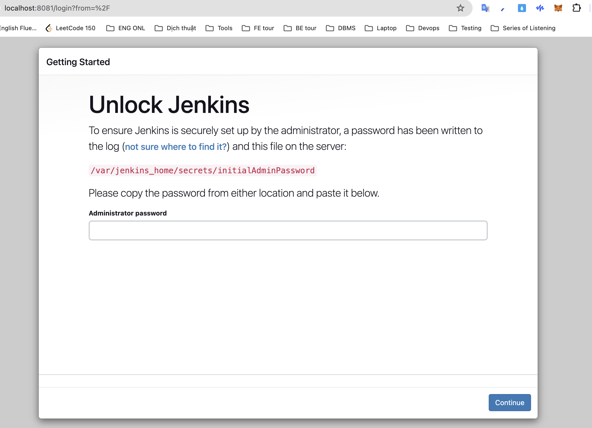
- Retrieve the initial admin password:
```bash
docker exec -it jenkins cat /var/jenkins_home/secrets/initialAdminPassword
```
- Install the suggested plugins and set up your admin account.
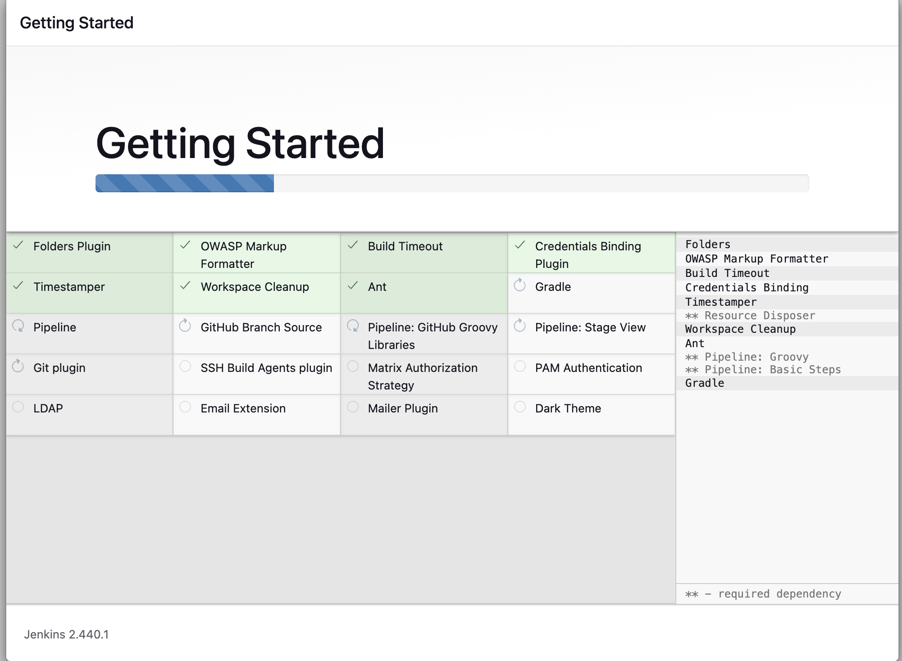
- Fill in the form as our expected ⇒ admin for all =))))
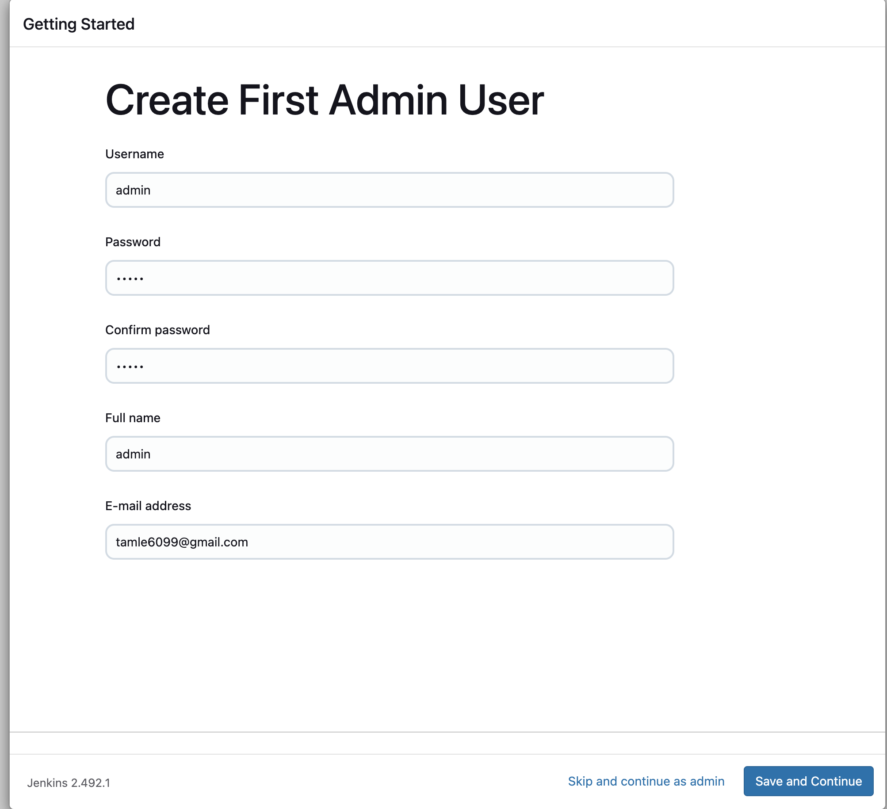
- Consider changing localhost into my IP address to easy to connect with outside 
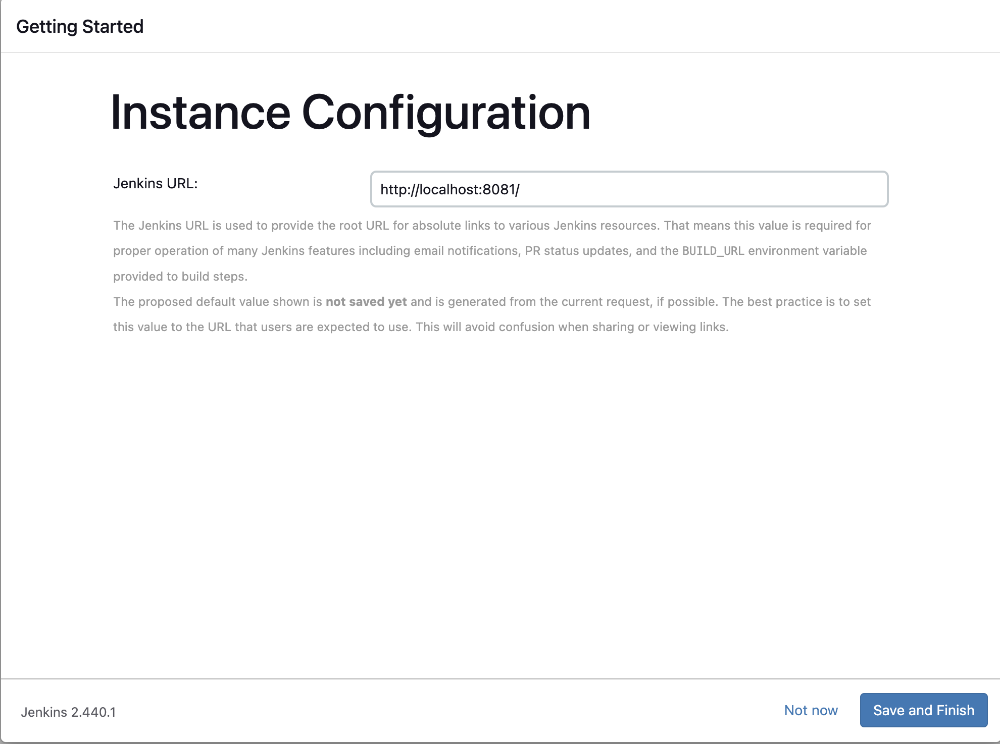

### 4. Credential Setup
To enable Jenkins to interact with your clusters, you must map the generated TLS certificates:
#### DOCKER
Because I'm setting up at local, I must connect my jenkins to docker throughout docker in docker (dind)
```
 --volume ~/build/cicd/jenkins-data:/var/jenkins_home \
 --volume ~/build/cicd/jenkins-docker-certs:/certs/client:ro \
```
could you see this code when building docker for jenkins 
At there, we found three files including ca.pem, cert.pem, key.pem and we have to create x059 to allow for jenkins to connect local docker 
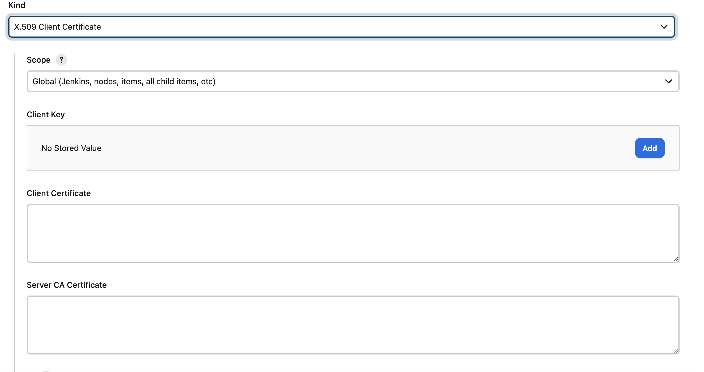
- Client Key: key.pem
- Client Certificate: cert.pem
- Server CA Certificate: ca.pem
The rest of this step is to create new cloud of docker type like that
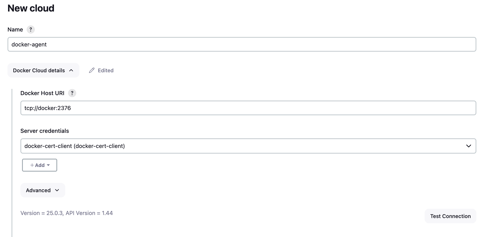
DONE!!!!
### Kubernetes
- Extract your cluster certificates (e.g., from ~/.kube/config) and add them to Jenkins to grant deployment access to your K8s environment
(because I'm using docker desktop, I can find it out at `~/.kube/config `).
and then, we will create certificate for kubernetes like that
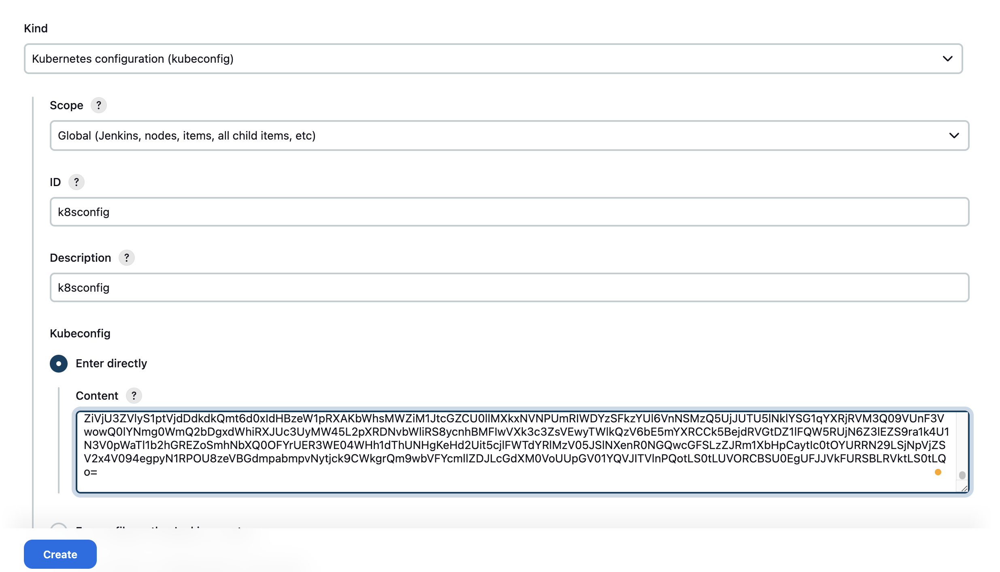
***DONE!!!!***
### 5. Running the Pipeline
Create a new Pipeline job in Jenkins, link it to your Git repository, and watch the automated build, test, and deployment processes in action! 
we just follow this steps at all 
1. we will choose `new item` and click `pipeline`
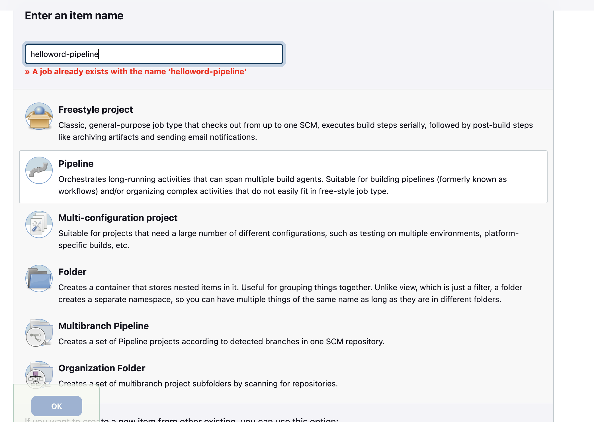
2.  we will set up for our jobs connect to github
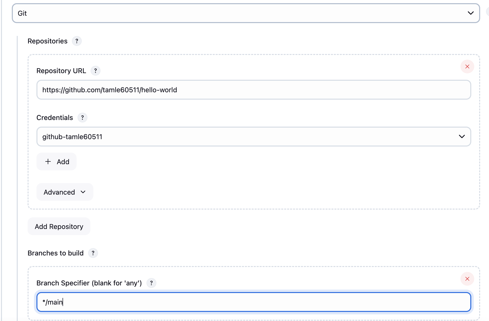
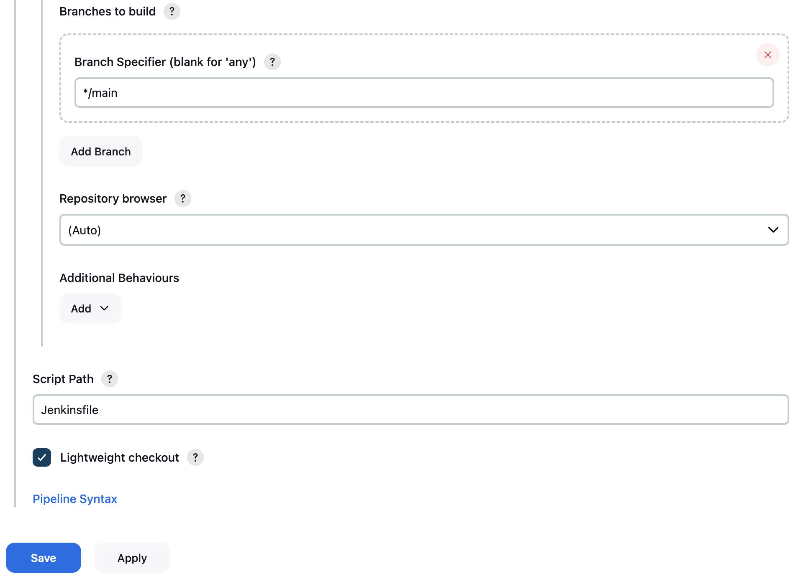

### 6. RESULT
After all, we just await for the result as our dream
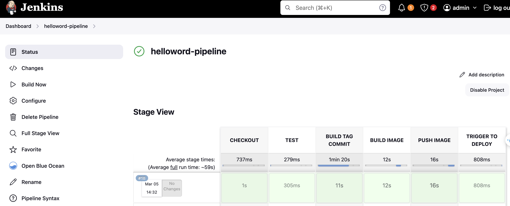

## 📝 License
This project is licensed under the MIT License - see the LICENSE file for details. Copyright (c) 2026 Liam Le.